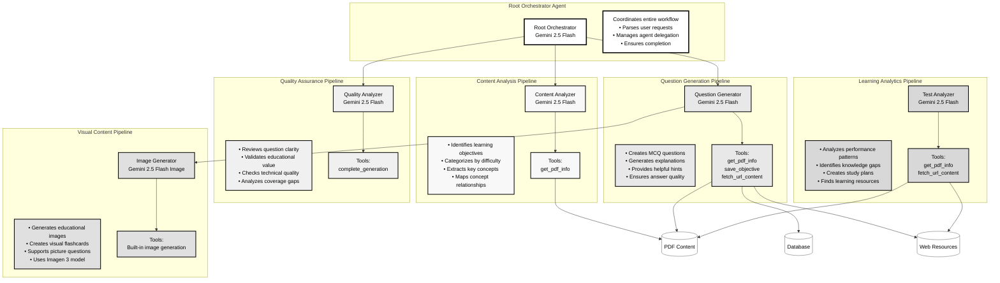

```mermaid
graph TD
    %% Agent Ecosystem Overview
    subgraph "Root Orchestrator Agent"
        RO[Root Orchestrator<br/>Gemini 2.5 Flash]
        RO_Prompt[Coordinates entire workflow<br/>• Parses user requests<br/>• Manages agent delegation<br/>• Ensures completion]
    end
    
    subgraph "Content Analysis Pipeline"
        CA[Content Analyzer<br/>Gemini 2.5 Flash]
        CA_Tasks[• Identifies learning objectives<br/>• Categorizes by difficulty<br/>• Extracts key concepts<br/>• Maps concept relationships]
        CA_Tools[Tools:<br/>get_pdf_info]
    end
    
    subgraph "Question Generation Pipeline"
        QG[Question Generator<br/>Gemini 2.5 Flash]
        QG_Tasks[• Creates MCQ questions<br/>• Generates explanations<br/>• Provides helpful hints<br/>• Ensures answer quality]
        QG_Tools[Tools:<br/>get_pdf_info<br/>save_objective<br/>fetch_url_content]
    end
    
    subgraph "Quality Assurance Pipeline"
        QA[Quality Analyzer<br/>Gemini 2.5 Flash]
        QA_Tasks[• Reviews question clarity<br/>• Validates educational value<br/>• Checks technical quality<br/>• Analyzes coverage gaps]
        QA_Tools[Tools:<br/>complete_generation]
    end
    
    subgraph "Visual Content Pipeline"
        IG[Image Generator<br/>Gemini 2.5 Flash Image]
        IG_Tasks[• Generates educational images<br/>• Creates visual flashcards<br/>• Supports picture questions<br/>• Uses Imagen 3 model]
        IG_Tools[Tools:<br/>Built-in image generation]
    end
    
    subgraph "Learning Analytics Pipeline"
        TA[Test Analyzer<br/>Gemini 2.5 Flash]
        TA_Tasks[• Analyzes performance patterns<br/>• Identifies knowledge gaps<br/>• Creates study plans<br/>• Finds learning resources]
        TA_Tools[Tools:<br/>get_pdf_info<br/>fetch_url_content]
    end
    
    %% Agent Interactions
    RO --> CA
    RO --> QG
    RO --> QA
    QG --> IG
    
    %% Tool Connections
    CA --> CA_Tools
    QG --> QG_Tools
    QA --> QA_Tools
    IG --> IG_Tools
    TA --> TA_Tools
    
    %% Data Flow
    CA_Tools --> PDF_Data[(PDF Content)]
    QG_Tools --> PDF_Data
    QG_Tools --> DB_Data[(Database)]
    QG_Tools --> Web_Data[(Web Resources)]
    TA_Tools --> PDF_Data
    TA_Tools --> Web_Data
    
    %% Clean Black & White Styling
    classDef orchestrator fill:#ffffff,stroke:#000000,stroke-width:3px,color:#000000
    classDef analyzer fill:#f8f8f8,stroke:#000000,stroke-width:2px,color:#000000
    classDef generator fill:#e8e8e8,stroke:#000000,stroke-width:2px,color:#000000
    classDef quality fill:#f0f0f0,stroke:#000000,stroke-width:2px,color:#000000
    classDef visual fill:#e0e0e0,stroke:#000000,stroke-width:2px,color:#000000
    classDef analytics fill:#d8d8d8,stroke:#000000,stroke-width:2px,color:#000000
    classDef data fill:#ffffff,stroke:#666666,stroke-width:1px,color:#000000
    
    class RO,RO_Prompt orchestrator
    class CA,CA_Tasks,CA_Tools analyzer
    class QG,QG_Tasks,QG_Tools generator
    class QA,QA_Tasks,QA_Tools quality
    class IG,IG_Tasks,IG_Tools visual
    class TA,TA_Tasks,TA_Tools analytics
    class PDF_Data,DB_Data,Web_Data data
```
