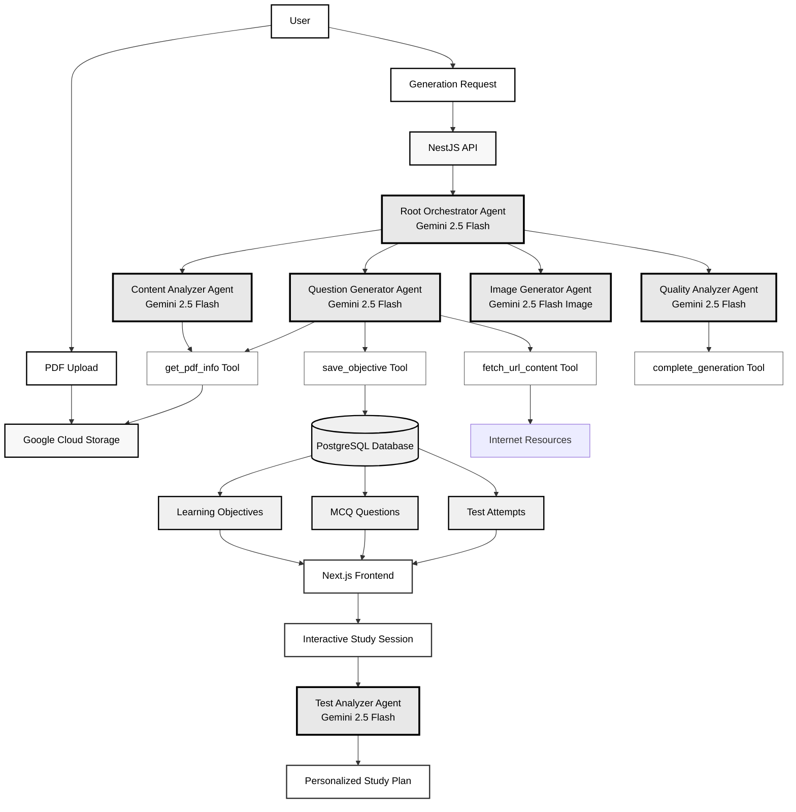

```mermaid
graph TB
    %% User Input Layer
    User[User] --> Upload[PDF Upload]
    User --> Request[Generation Request]
    
    %% Infrastructure Layer
    Upload --> GCS[Google Cloud Storage]
    Request --> API[NestJS API]
    
    %% AI Agent Orchestration Layer
    API --> Orchestrator[Root Orchestrator Agent<br/>Gemini 2.5 Flash]
    
    %% Core AI Agents
    Orchestrator --> ContentAnalyzer[Content Analyzer Agent<br/>Gemini 2.5 Flash]
    Orchestrator --> QuestionGenerator[Question Generator Agent<br/>Gemini 2.5 Flash]
    Orchestrator --> QualityAnalyzer[Quality Analyzer Agent<br/>Gemini 2.5 Flash]
    Orchestrator --> ImageGenerator[Image Generator Agent<br/>Gemini 2.5 Flash Image]
    
    %% AI Tools Layer
    ContentAnalyzer --> GetPdfTool[get_pdf_info Tool]
    QuestionGenerator --> GetPdfTool
    QuestionGenerator --> SaveObjectiveTool[save_objective Tool]
    QuestionGenerator --> WebSearchTool[fetch_url_content Tool]
    QualityAnalyzer --> CompletionTool[complete_generation Tool]
    
    %% Data Layer
    GetPdfTool --> GCS
    SaveObjectiveTool --> Database[(PostgreSQL Database)]
    WebSearchTool --> Internet[Internet Resources]
    
    %% Storage Layer
    Database --> Objectives[Learning Objectives]
    Database --> Questions[MCQ Questions]
    Database --> TestAttempts[Test Attempts]
    
    %% Output Layer
    Objectives --> Frontend[Next.js Frontend]
    Questions --> Frontend
    TestAttempts --> Frontend
    Frontend --> StudySession[Interactive Study Session]
    
    %% Analysis Layer
    StudySession --> TestAnalyzer[Test Analyzer Agent<br/>Gemini 2.5 Flash]
    TestAnalyzer --> StudyPlan[Personalized Study Plan]
    
    %% Clean Black & White Styling
    classDef userLayer fill:#ffffff,stroke:#000000,stroke-width:2px,color:#000000
    classDef infraLayer fill:#f8f8f8,stroke:#000000,stroke-width:2px,color:#000000
    classDef agentLayer fill:#e8e8e8,stroke:#000000,stroke-width:3px,color:#000000
    classDef toolLayer fill:#ffffff,stroke:#666666,stroke-width:1px,color:#000000
    classDef dataLayer fill:#f0f0f0,stroke:#000000,stroke-width:2px,color:#000000
    classDef outputLayer fill:#ffffff,stroke:#333333,stroke-width:2px,color:#000000
    
    class User,Upload,Request userLayer
    class GCS,API infraLayer
    class Orchestrator,ContentAnalyzer,QuestionGenerator,QualityAnalyzer,ImageGenerator,TestAnalyzer agentLayer
    class GetPdfTool,SaveObjectiveTool,WebSearchTool,CompletionTool toolLayer
    class Database,Objectives,Questions,TestAttempts dataLayer
    class Frontend,StudySession,StudyPlan outputLayer
```
