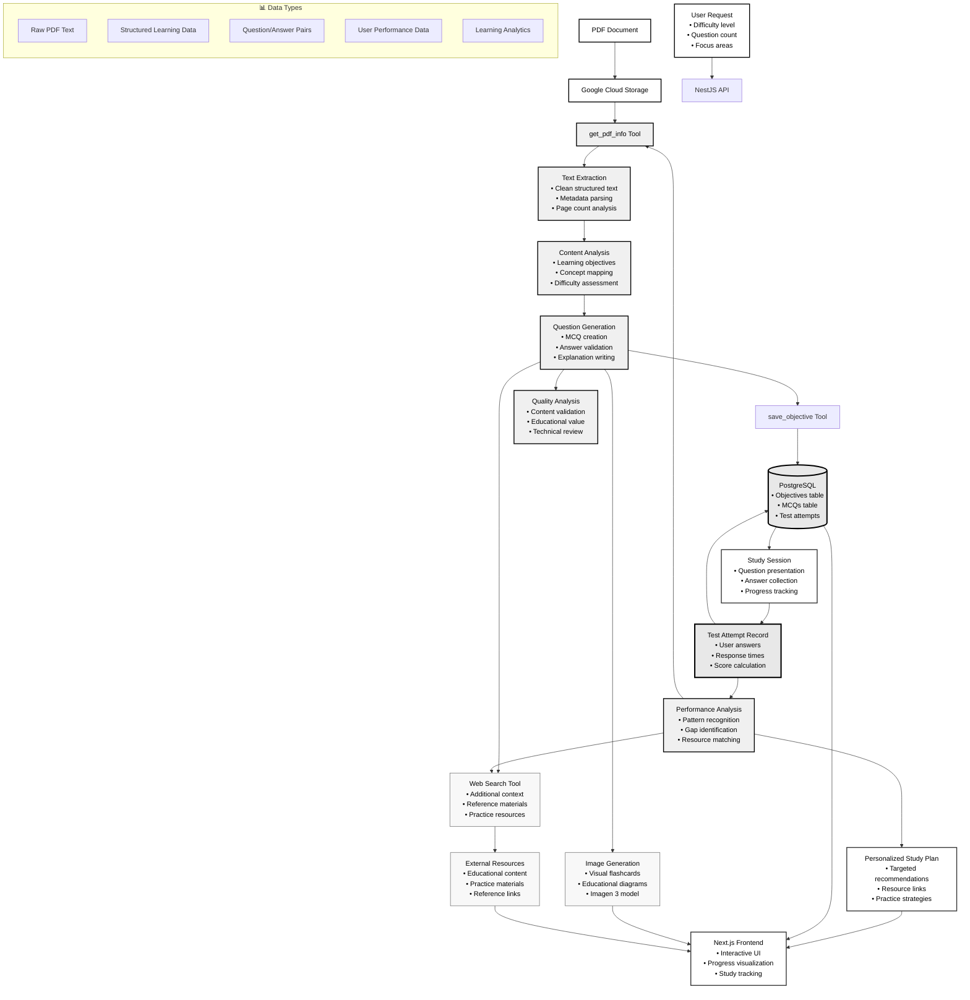

```mermaid
flowchart TD
    %% Input Sources
    PDF[PDF Document] --> GCS[Google Cloud Storage]
    UserReq[User Request<br/>• Difficulty level<br/>• Question count<br/>• Focus areas] --> API[NestJS API]
    
    %% PDF Processing Pipeline
    GCS --> PDFTool[get_pdf_info Tool]
    PDFTool --> TextExtract[Text Extraction<br/>• Clean structured text<br/>• Metadata parsing<br/>• Page count analysis]
    
    %% AI Processing Chain
    TextExtract --> ContentAnalysis[Content Analysis<br/>• Learning objectives<br/>• Concept mapping<br/>• Difficulty assessment]
    
    ContentAnalysis --> QuestionGen[Question Generation<br/>• MCQ creation<br/>• Answer validation<br/>• Explanation writing]
    
    QuestionGen --> SaveTool[save_objective Tool]
    SaveTool --> Database[(PostgreSQL<br/>• Objectives table<br/>• MCQs table<br/>• Test attempts)]
    
    %% Quality & Enhancement
    QuestionGen --> QualityCheck[Quality Analysis<br/>• Content validation<br/>• Educational value<br/>• Technical review]
    
    QuestionGen --> ImageGen[Image Generation<br/>• Visual flashcards<br/>• Educational diagrams<br/>• Imagen 3 model]
    
    %% Web Enhancement
    QuestionGen --> WebSearch[Web Search Tool<br/>• Additional context<br/>• Reference materials<br/>• Practice resources]
    WebSearch --> ExternalData[External Resources<br/>• Educational content<br/>• Practice materials<br/>• Reference links]
    
    %% Study Session Data Flow
    Database --> StudySession[Study Session<br/>• Question presentation<br/>• Answer collection<br/>• Progress tracking]
    
    StudySession --> TestAttempt[Test Attempt Record<br/>• User answers<br/>• Response times<br/>• Score calculation]
    
    TestAttempt --> Database
    
    %% Analytics Pipeline
    TestAttempt --> Analytics[Performance Analysis<br/>• Pattern recognition<br/>• Gap identification<br/>• Resource matching]
    
    Analytics --> WebSearch
    Analytics --> PDFTool
    Analytics --> StudyPlan[Personalized Study Plan<br/>• Targeted recommendations<br/>• Resource links<br/>• Practice strategies]
    
    %% Output Delivery
    StudyPlan --> Frontend[Next.js Frontend<br/>• Interactive UI<br/>• Progress visualization<br/>• Study tracking]
    
    Database --> Frontend
    ImageGen --> Frontend
    ExternalData --> Frontend
    
    %% Data Types Legend
    subgraph "📊 Data Types"
        direction TB
        RawData[Raw PDF Text]
        StructData[Structured Learning Data]
        QuestData[Question/Answer Pairs]
        UserData[User Performance Data]
        AnalyticsData[Learning Analytics]
    end
    
    %% Clean Black & White Styling
    classDef input fill:#ffffff,stroke:#000000,stroke-width:2px,color:#000000
    classDef processing fill:#f0f0f0,stroke:#000000,stroke-width:2px,color:#000000
    classDef storage fill:#e8e8e8,stroke:#000000,stroke-width:3px,color:#000000
    classDef output fill:#ffffff,stroke:#333333,stroke-width:2px,color:#000000
    classDef enhancement fill:#f8f8f8,stroke:#666666,stroke-width:1px,color:#000000
    
    class PDF,UserReq,GCS input
    class PDFTool,TextExtract,ContentAnalysis,QuestionGen,QualityCheck,Analytics processing
    class Database,TestAttempt storage
    class Frontend,StudySession,StudyPlan output
    class ImageGen,WebSearch,ExternalData enhancement
```
