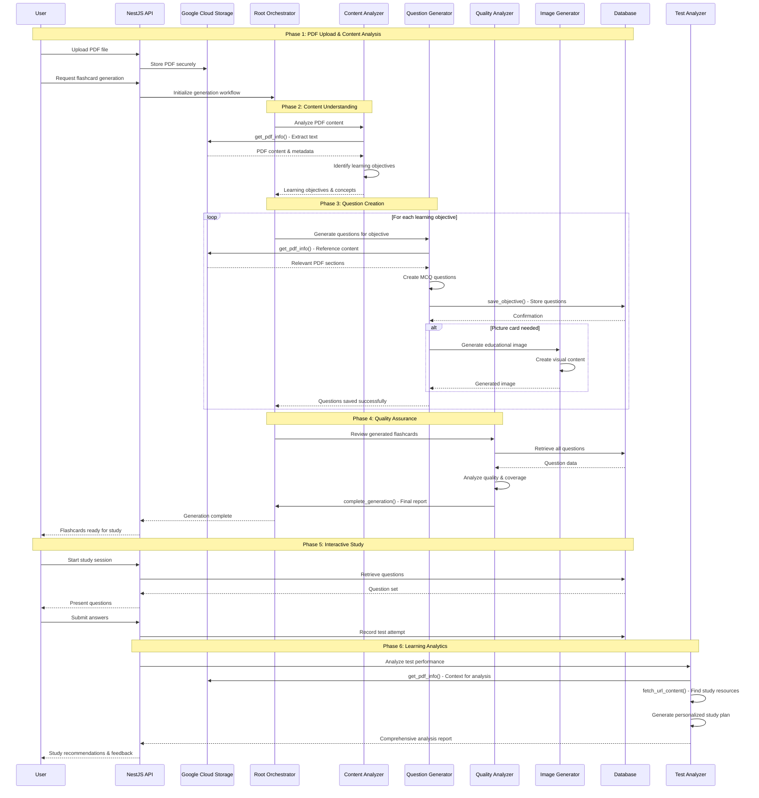

```mermaid
sequenceDiagram
    participant U as User
    participant API as NestJS API
    participant GCS as Google Cloud Storage
    participant RO as Root Orchestrator
    participant CA as Content Analyzer
    participant QG as Question Generator
    participant QA as Quality Analyzer
    participant IG as Image Generator
    participant DB as Database
    participant TA as Test Analyzer
    
    %% Phase 1: PDF Upload & Processing
    Note over U,DB: Phase 1: PDF Upload & Content Analysis
    U->>API: Upload PDF file
    API->>GCS: Store PDF securely
    U->>API: Request flashcard generation
    API->>RO: Initialize generation workflow
    
    %% Phase 2: Content Analysis
    Note over RO,CA: Phase 2: Content Understanding
    RO->>CA: Analyze PDF content
    CA->>GCS: get_pdf_info() - Extract text
    GCS-->>CA: PDF content & metadata
    CA->>CA: Identify learning objectives
    CA-->>RO: Learning objectives & concepts
    
    %% Phase 3: Question Generation
    Note over RO,QG: Phase 3: Question Creation
    loop For each learning objective
        RO->>QG: Generate questions for objective
        QG->>GCS: get_pdf_info() - Reference content
        GCS-->>QG: Relevant PDF sections
        QG->>QG: Create MCQ questions
        QG->>DB: save_objective() - Store questions
        DB-->>QG: Confirmation
        
        %% Optional: Image generation for visual questions
        alt Picture card needed
            QG->>IG: Generate educational image
            IG->>IG: Create visual content
            IG-->>QG: Generated image
        end
        
        QG-->>RO: Questions saved successfully
    end
    
    %% Phase 4: Quality Review
    Note over RO,QA: Phase 4: Quality Assurance
    RO->>QA: Review generated flashcards
    QA->>DB: Retrieve all questions
    DB-->>QA: Question data
    QA->>QA: Analyze quality & coverage
    QA->>RO: complete_generation() - Final report
    RO-->>API: Generation complete
    API-->>U: Flashcards ready for study
    
    %% Phase 5: Study Session
    Note over U,DB: Phase 5: Interactive Study
    U->>API: Start study session
    API->>DB: Retrieve questions
    DB-->>API: Question set
    API-->>U: Present questions
    U->>API: Submit answers
    API->>DB: Record test attempt
    
    %% Phase 6: Performance Analysis
    Note over API,TA: Phase 6: Learning Analytics
    API->>TA: Analyze test performance
    TA->>GCS: get_pdf_info() - Context for analysis
    TA->>TA: fetch_url_content() - Find study resources
    TA->>TA: Generate personalized study plan
    TA-->>API: Comprehensive analysis report
    API-->>U: Study recommendations & feedback
```
